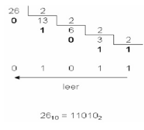

## Trabajo práctico N° 2 - Recursión y ordenamiento
# Primera parte
# Ejercicio 1
Implemente un algoritmo recursivo que determine si un arreglo de tamaño N está ordenado y responda:
1. ¿Qué complejidad O tiene? (La complejidad en el peor caso)
2. ¿Trae algún problema hacerlo recursivo? ¿Cuál?
3. ¿Qué cambiaría si la estructura fuera una lista en lugar de un arreglo?

## Ejercicio 2
Implemente un algoritmo recursivo para buscar un elemento en un arreglo ordenado ascendentemente.

## Ejercicio 3
Implemente un algoritmo recursivo que convierta un número en notación decimal a su
equivalente en notación binaria.
Recordatorio, por ejemplo convertir el 26 a binario:

# Ejercicio 4
Implemente un algoritmo recursivo que presente los primeros N términos de la secuencia de Fibonacci.
Por ej. los 6 primeros términos son: 0 1 1 2 3 5

# Ejercicio 5
Dado un arreglo ordenado de números distintos A se desea construir un algoritmo que
determine si alguno de los elementos de dicho arreglo contiene un valor igual a la posición en la
cuál se encuentra, es decir, A[i] = i.
1. Construir un algoritmo recursivo que responda a dicha verificación.
2. Mostrar la pila de ejecución para la invocación algoritmo([-3, -1, 0, 2, 4, 6, 10])

## Ejercicio 6
Implemente un algoritmo de ordenamiento por selección en un arreglo.
Implemente un algoritmo de ordenamiento por burbujeo en un arreglo.
● ¿Qué complejidad big-O tienen estos algoritmos?

## Ejercicio 7
Implemente un algoritmo de ordenamiento mergesort para un arreglo de tamaño N.
Implemente un algoritmo de ordenamiento quicksort para un arreglo de tamaño N.
● ¿Cuál es su complejidad en el peor caso? O(n logn)
● ¿Cuál es su complejidad promedio? O(n^2)

MergeSort es más predecible y estable, pero usa más memoria.
QuickSort es más rápido en la práctica, pero puede degradarse a O(n²).

## Ejercicio 8
Investigar cómo está implementado el algoritmo Collection.Sort de Java y qué características deben cumplir los elementos almacenados dentro de la colección a ordenar

1) ¿Qué algoritmo usa Collections.sort()?
La implementación de Collections.sort() no es un simple quicksort o heap sort, sino una variante sofisticada llamada Timsort:

Es una mezcla adaptativa y estable de merge sort optimizada para aprovechar ordenamientos parciales que ya existen en los datos.

Ofrece un rendimiento garantizado O(n log n) en el peor caso, y en listas casi ordenadas puede acercarse a O(n).

Usa una estructura intermedia (convierte la lista en arreglo, ordena el arreglo, y luego escribe de vuelta en la lista) para mantener eficiencia incluso en listas enlazadas.

Importante:
La estabilidad significa que si dos elementos son “iguales” según el comparador, su orden relativo original no cambia tras la ordenación.

2) ¿Qué métodos de ordenación existen en Collections?

Java ofrece dos formas principales de llamar a sort:
Collections.sort(List<T> list)
Ordena la lista según el orden natural de sus elementos (T debe ser Comparable).
Collections.sort(List<T> list, Comparator<? super T> c)
Ordena usando un Comparator externo que definís.

3) Requisitos para los elementos a ordenar
a. Uso de orden natural (Comparable)
Si usas: Collections.sort(list);
entonces cada elemento de la lista debe implementar: Comparable<? super T>
La clase debe implementar Comparable y definir: public int compareTo(T otro);

b. Uso de orden con Comparator
Si usás: Collections.sort(list, miComparator);
entonces:

✔️ No importa si los elementos implementan Comparable, siempre que el Comparator pueda compararlos.
✔️ El método compare(o1, o2) del comparator debe también cumplir un contrato de orden consistente.
✔️ Si no podés comparar algunos elementos con el comparator, también se lanza ClassCastException.

4) Contratos y reglas (resumen importante)

🔸 Consistencia con equals (recomendado):
Si compare(a, b) == 0, se recomienda que a.equals(b) también sea verdadero (aunque no es obligatorio por contrato, evita comportamientos inesperados).

🔸 Comparar tipos distintos:
No puedes ordenar listas con elementos de tipos incompatibles (por ejemplo, mezclar String y Integer) porque las comparaciones no tienen sentido y lanzará ClassCastException.

🧪 Ejemplos de implementación
📌 Comparable (orden natural)
public class Persona implements Comparable<Persona> {
    private String nombre;

    @Override
    public int compareTo(Persona o) {
        return this.nombre.compareTo(o.nombre);
    }
}

Ordena por nombre cuando llamás:

Collections.sort(listaPersonas);

📌 Comparator (orden personalizado)
Comparator<Persona> porEdad = (p1, p2) ->
    Integer.compare(p1.getEdad(), p2.getEdad());

Collections.sort(listaPersonas, porEdad);

Ordena por edad sin que Persona implemente Comparable.

📌 Nota adicional de versiones recientes

Desde Java 8 también podés usar:

list.sort(comparator);

que es equivalente a Collections.sort(list, comparator).